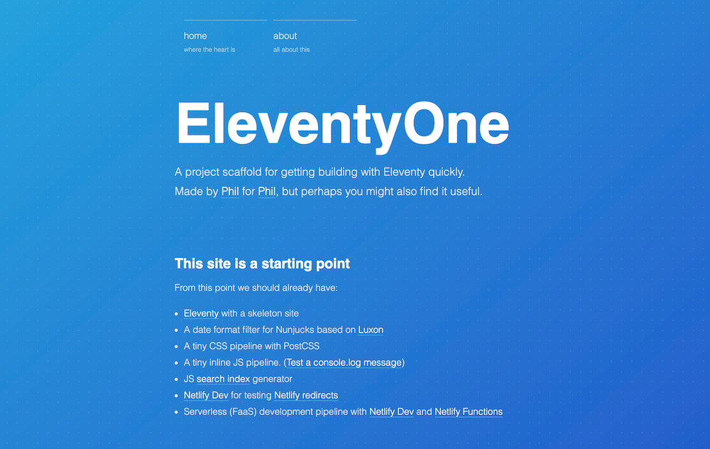

# Ravisankar's Portfolio

This is my personal portfolio site, built using [Eleventy](https://11ty.io) and inspired by the EleventyOne template created by [Phil Hawksworth](https://twitter.com/philhawksworth).

The project includes:

- [Eleventy](https://11ty.io) for static site generation
- A date format filter for Nunjucks based on [Luxon](https://moment.github.io/luxon)
- A CSS pipeline with PostCSS
- An inline JS pipeline
- JS search index generator
- [Netlify Dev](https://www.netlify.com/products/dev) for testing [Netlify redirects](https://netlify.com/docs/redirects/)
- Serverless (FaaS) development pipeline with [Netlify Functions](https://www.netlify.com/products/functions)

